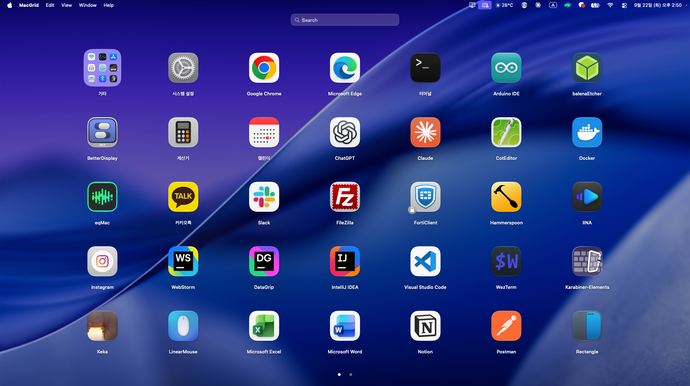

# MacGrid — Launchpad for macOS Tahoe and later

**English** | [한국어](README.ko.md)

A faithful recreation of Launchpad, which Apple removed in macOS Tahoe. SwiftUI + AppKit. Requires macOS 26 (Tahoe) or later on Apple Silicon.



## Install

**Requirements:** macOS 26 (Tahoe) or later, Apple Silicon.

### Option 1 — Download

1. Grab `MacGrid.dmg` from the [latest release](../../releases/latest).
2. Open it and drag `MacGrid.app` to `Applications`.
3. Before the first launch, run this once in Terminal:

   ```bash
   xattr -cr /Applications/MacGrid.app
   ```

   MacGrid is an open-source app without an Apple Developer ID signature, so Gatekeeper marks the download as "damaged". This command clears that flag.

### Option 2 — Build from source

Xcode must be installed (App Store).

```bash
git clone https://github.com/<you>/MacGrid.git
cd MacGrid
./install.sh
```

The script builds the app, installs it to `/Applications/MacGrid.app` and launches it. Apps you build yourself need no `xattr` step.

### After installing

Open and close MacGrid with **⌃Space**, the Dock icon, or the menu bar icon.
Launch at login, the hotkey and the menu bar icon can be toggled in Settings (⌘,).

## Usage

| Action | How |
|---|---|
| Open / close | ⌃Space, Dock icon, menu bar icon / ESC, click empty area, switch to another app |
| Launch an app | Click its icon |
| Change page | Horizontal drag, two-finger trackpad swipe, mouse wheel, ←/→, click a page dot |
| Edit (jiggle) mode | Press and hold an icon for 0.4 s |
| Rearrange | Drag in edit mode (to another page: drag to the screen edge and wait; past the last page → new page) |
| Clean Up | "Clean Up" button in edit mode — packs all icons from the front |
| Create a folder | Drop an icon onto the center of another icon |
| Add to / remove from folder | Drop an icon onto a folder / open the folder and drag the icon outside the panel |
| Folder pages | Folders page in 7×5 too — drag / swipe / wheel / ←→ / dots |
| Rename a folder | Open it and click the title |
| Search | Just start typing; Return launches the first result |
| Settings | MacGrid menu → Settings… (⌘,): launch at login, hotkey, menu bar icon, background (current wallpaper / solid color), transparency, blur |

- There is deliberately no way to delete apps. Delete them in Finder; the grid updates on next open.
- A folder with a single app left is dissolved automatically.
- The background reads the system wallpaper setting and follows changes on next open. A wallpaper chosen from the Photos app asks for Photos access once.
- If MacGrid has been closed for more than a minute, it reopens on page 1.

## Scanned locations

`/Applications`, `/System/Applications`, `~/Applications` (two levels deep, including Utilities).
App names are read from each bundle's localization files in the system language order, so they match Finder.

## Data

Layout (pages / folders) is stored in `~/Library/Application Support/MacGrid/layout.json`. Delete it to reset.

## Source layout

| File | Role |
|---|---|
| `MacGridApp.swift` | Entry point, full-screen window, key / scroll monitors, hotkey · menu bar · login item, show / hide |
| `AppSettings.swift` / `SettingsView.swift` | Settings (UserDefaults) and the Settings window |
| `HotKey.swift` | Carbon global hotkey |
| `WallpaperCapture.swift` | Find the current wallpaper image (file / built-in / Photos) |
| `AppScanner.swift` | Scan the Applications folders |
| `LayoutStore.swift` | Page / folder model, clean up, JSON persistence, app reconciliation |
| `UIState.swift` | Page / edit mode / folder / search / swipe state |
| `DragController.swift` | Drag-to-rearrange, folder creation, page flipping |
| `LaunchpadRoot.swift` | Root view, pager, search bar, page dots, drag ghost, background |
| `IconCell.swift` | Icon cell (gestures), icon / folder icon drawing, jiggle |
| `FolderOverlay.swift` | Open-folder panel |
| `Models.swift` | Data models, grid geometry |

## Building a DMG (distribution)

```bash
./build_dmg.sh        # → dist/MacGrid.dmg
```

Open the DMG and drag `MacGrid.app` to `Applications`. The app is ad-hoc signed, so on other Macs Gatekeeper shows a "damaged" warning on first launch; run `xattr -cr /Applications/MacGrid.app` or use "Open Anyway" in System Settings → Privacy & Security. Only an Apple Developer ID signature plus notarization removes this.

## License

[MIT](LICENSE)
